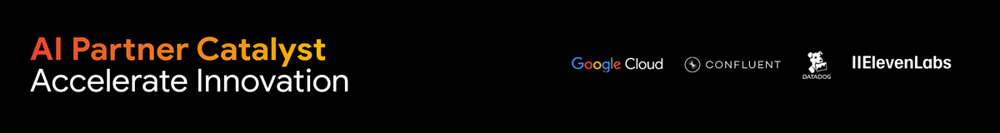
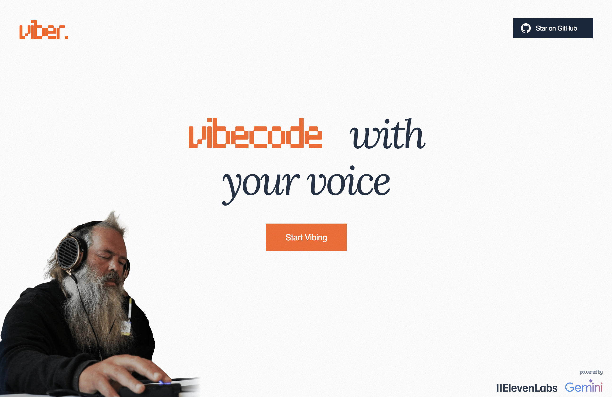
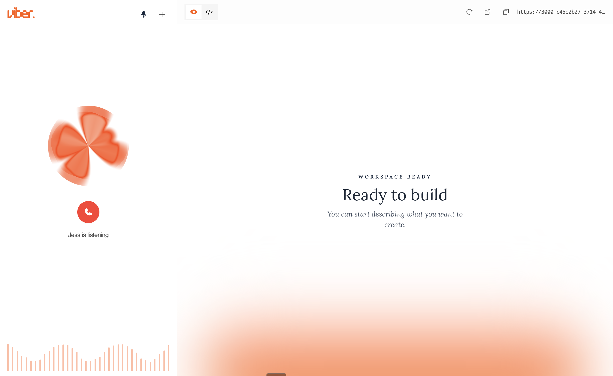
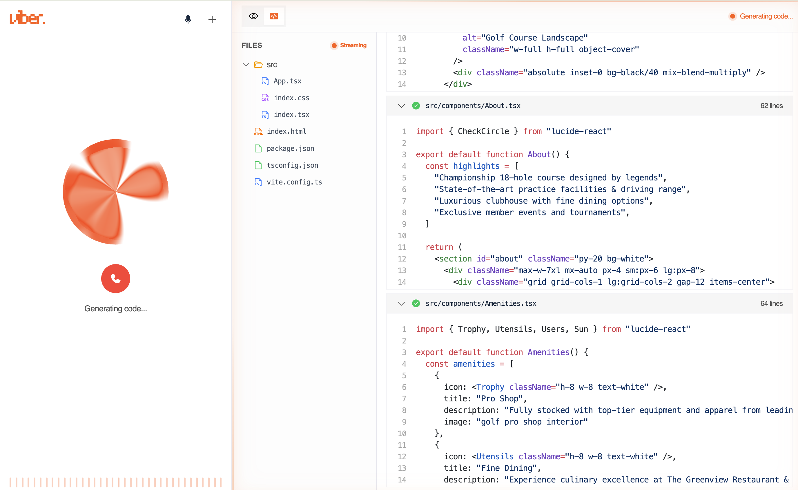

<p align="center">
  
  &nbsp;&nbsp;&nbsp;&nbsp;&nbsp;&nbsp;&nbsp;&nbsp;
</p>

<p align="center">
  
</p>


<p align="center">
  <em>Vibecode with your voice </em>
</p>

<p align="center">
  
  
  
  
  
  
  
</p>

<br/>

<p align="center">
  
</p>

<p align="center">
  
</p>

<p align="center">
  
</p>

Viber is a speech-first coding experience: you describe what you want to build, the agent generates/edits real code, applies it to a sandboxed workspace, and you immediately see the result in a live preview — all while the voice agent narrates what’s happening.

## Key Differentiators

- **Voice-first UX**: talk like you’re speaking to another developer; no keyboard required for the primary workflow.
- **Real code, real preview**: generated files are applied to a sandbox environment and reflected instantly in the preview.
- **Agentic tool calling**: the ElevenLabs voice agent can trigger build actions and UI navigation via client-side tools.
- **Surgical edits (context-aware)**: edit requests focus on relevant files rather than blasting the model with the entire codebase.
- **Image-aware generation**: LLM-produced image descriptions are translated into real images via an Unsplash-backed API route.

## Architecture

- **User Device**: voice input + real-time UI preview
- **ElevenLabs Voice Agent**: conversation loop, tool calls, narrated status updates
- **Gemini Code Agent**: architecture + implementation (and fast routing/intent steps where applicable)
- **Sandbox**: runs the generated Vite app and serves a preview URL

<p align="center">
  
</p>

## Getting Started

### Prerequisites

- Bun (recommended)
- Node.js 18+ (optional; Bun is the primary path here)
- Google Gemini API key
- Unsplash API keys
- ElevenLabs API key + Agent ID (optional, required only for voice mode)

### Environment

Create a `.env` file (or set env vars in your hosting provider):

```bash
GEMINI_API_KEY=...
DEFAULT_MODEL=gemini-3-pro

SANDBOX_API_KEY=...

UNSPLASH_ACCESS_KEY=...
UNSPLASH_SECRET_KEY=...

# Optional (voice)
ELEVENLABS_API_KEY=...
VITE_ELEVENLABS_AGENT_ID=...

# Optional (useful when the sandbox needs a public origin)
IMAGE_CDN_BASE_URL=...
```

### Install & Run (Local)

```bash
bun install
bun run dev
```

The app runs on `http://localhost:3000`.

### Production Build (Local)

```bash
bun run build
bun run start
```

### Useful Scripts

- `bun run dev` - Start the app (Vite dev server on port 3000)
- `bun run build` - Build for production
- `bun run start` - Run the production server output
- `bun run test` - Run tests (Vitest)

## Docker

### Build & Run

```bash
docker build -t viber .
docker run --rm -p 3000:3000 \
  -e GEMINI_API_KEY=... \
  -e SANDBOX_API_KEY=... \
  -e UNSPLASH_ACCESS_KEY=... \
  -e UNSPLASH_SECRET_KEY=... \
  -e ELEVENLABS_API_KEY=... \
  -e IMAGE_CDN_BASE_URL=... \
  viber
```

Note: `VITE_ELEVENLABS_AGENT_ID` is a client-side (Vite) env var and is compiled into the frontend during build.

### Convenience Script

You can also use:

```bash
./docker.sh
```

## Deployment (Google Cloud Run)

```bash
gcloud auth login
gcloud config set project YOUR_PROJECT_ID

gcloud services enable run.googleapis.com cloudbuild.googleapis.com

gcloud builds submit --tag gcr.io/YOUR_PROJECT_ID/viber .

gcloud run deploy viber \
  --image gcr.io/YOUR_PROJECT_ID/viber \
  --region us-central1 \
  --allow-unauthenticated \
  --port 3000 \
  --set-env-vars GEMINI_API_KEY=... \
  --set-env-vars SANDBOX_API_KEY=... \
  --set-env-vars UNSPLASH_ACCESS_KEY=... \
  --set-env-vars UNSPLASH_SECRET_KEY=...
```

## Links

<div align="center">
  <a href="https://ai-partner-catalyst.devpost.com/">
    
  </a>
</div>

---

<p align="center">
  <em>Viber ~ because coding should feel like a conversation</em>
</p>
